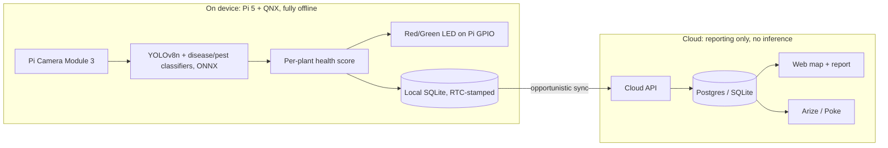

# Acre — Handheld Plant Scanner

A field-deployable, offline-first AI plant scanner for the AI Hackathon @ Berkeley 2026.

You carry **Acre** and point it at a plant. On-device, it identifies the plant,
detects disease and pests, and computes a 0-100 health score — then lights an LED
on the Raspberry Pi: **green = healthy, red = needs treatment**. The red LED is the
spray-substitute ("treat this one"). Everything intelligent runs locally on the
Pi 5 / QNX board; the cloud is reporting-only (map, pesticide list, AI summary).

See the full spec in [docs/Acre_PRD.md](docs/Acre_PRD.md).

**QNX Pi + laptop demo (friend's setup):** [docs/DEMO_RUNBOOK.md](docs/DEMO_RUNBOOK.md)

## Architecture: local does the thinking, cloud does the reporting



## Repo layout

| Path | What it is |
|---|---|
| [docs/Acre_PRD.md](docs/Acre_PRD.md) | Product requirements document |
| `edge/` | On-device pipeline: capture, ONNX detection, classifiers, ArUco zones, health score, GPIO LED, SQLite, sync agent |
| `models/` | Off-device training + ONNX export for the 3 models |
| `cloud/` | FastAPI reporting backend (sync ingest, aggregation, Claude summary) |
| `web/` | Next.js dashboard: farm map, pesticide table, AI summary |
| `cloud/integrations/` | Optional Arize (monitoring) + Poke (conversational report) |

## Quickstart

### 1. Edge (runs on a laptop too, with stubs)

```bash
pip install -r requirements.txt
python -m edge.main --once          # single scan: prints finding + LED state
python -m edge.main                 # continuous handheld scan loop
```

On a dev laptop with no camera/models it uses synthetic frames, disables missing
model stages, and prints LED states. On the Pi it lights the real LED via GPIO.
Set `ACRE_SENSORS_ENABLED=1` to include the optional environmental sensors.

### 2. Cloud (reporting API)

```bash
pip install -r cloud/requirements.txt
python -m cloud.seed                                  # farm + zones + UC IPM + demo data
uvicorn cloud.app.main:app --reload --port 8000
```

Point the device at it: `ACRE_BACKEND_URL=http://<host>:8000/api/sync`.
Defaults to local SQLite; set `ACRE_DATABASE_URL` for Postgres/Supabase.

### 3. Web dashboard

```bash
cd web
npm install
cp .env.example .env.local
npm run dev                          # http://localhost:3000
```

### 4. Train the models (off-device)

```bash
cd models
pip install -r requirements-train.txt
python train_detector.py --data data/weed_crop/data.yaml --epochs 50
python train_disease_classifier.py --data data/plantvillage --epochs 15
python train_pest_classifier.py --data data/ip102_subset --epochs 15
# -> artifacts/*.onnx copied to the Pi; edge/detect.py loads them
```

## Key environment variables

| Var | Default | Used by |
|---|---|---|
| `ACRE_BACKEND_URL` | `http://localhost:8000/api/sync` | edge sync agent |
| `ACRE_HEALTH_THRESHOLD` | `70` | edge LED green/red cutoff |
| `ACRE_SENSORS_ENABLED` | `0` | edge optional sensors |
| `ACRE_DATABASE_URL` | `sqlite:///./acre_cloud.db` | cloud DB |
| `ANTHROPIC_API_KEY` | (unset → offline summary) | cloud AI summary |
| `NEXT_PUBLIC_ACRE_API` | `http://localhost:8000` | web app |

## Hardware (handheld build)

Pi 5 (QNX) + Pi Camera Module 3 (CSI) + RGB LED & buzzer & 1602 LCD on Pi GPIO +
DS1302 RTC. No servo, no laser, no Arduino on the critical path — the LED replaces
the laser/spray. Full inventory and wiring rationale in the PRD (sections 5-7).
